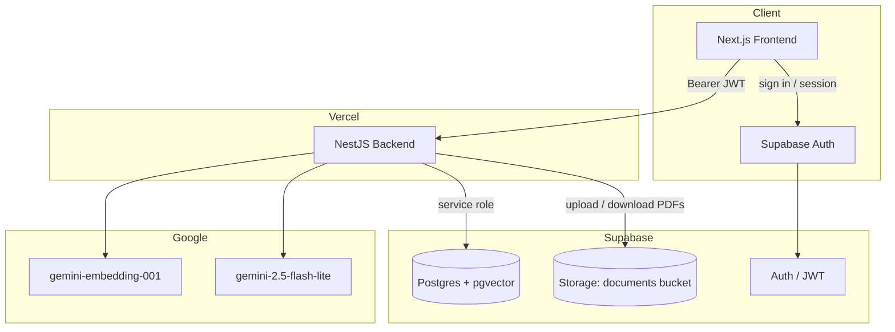
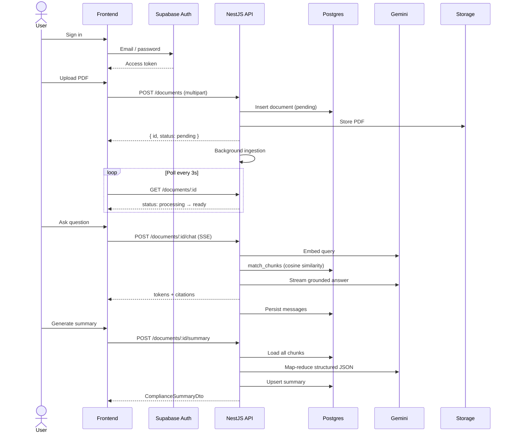
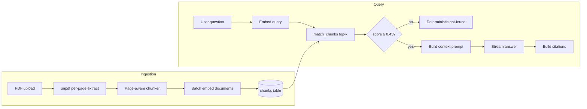
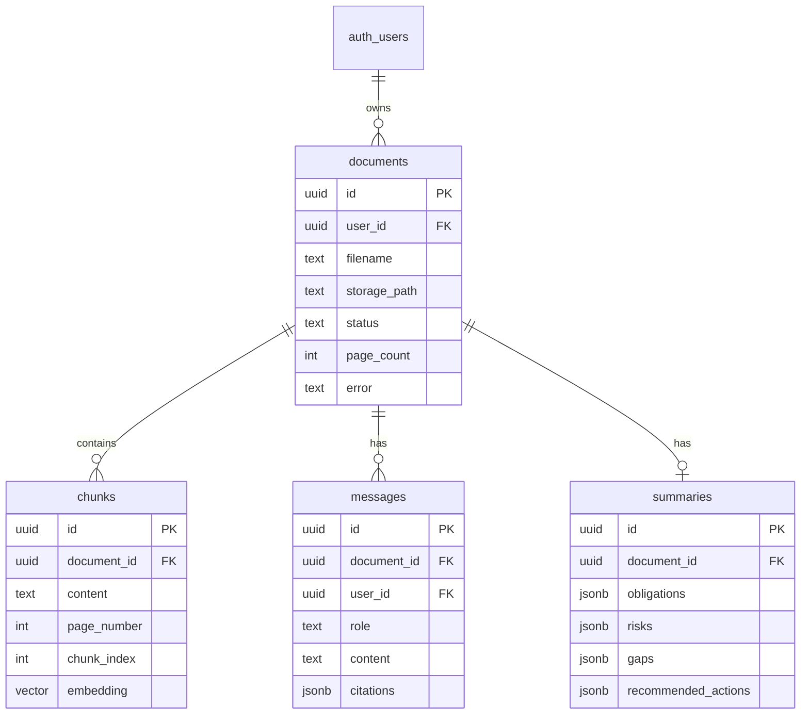

# Architecture

Compliance Copilot is a monorepo with three packages:

```
compliance-copilot/
├── frontend/          # Next.js web app (port 3000)
├── backend/           # NestJS API (port 4000)
├── packages/shared/   # Shared DTOs and constants
└── supabase/          # SQL migrations (Postgres + pgvector + Storage)
```

The frontend handles authentication via Supabase Auth and calls the NestJS API with a Bearer token. The backend owns all AI and data operations using the Supabase **service role** key.

## High-level diagram



## User flow



## Backend modules

| Module             | Responsibility                                                |
| ------------------ | ------------------------------------------------------------- |
| `DocumentsModule`  | PDF upload, listing, ownership checks, ingestion trigger      |
| `IngestionService` | Extract text → chunk → embed → store (async, fire-and-forget) |
| `RetrievalService` | Vector search via `match_chunks` RPC                          |
| `ChatModule`       | RAG Q&A with SSE streaming and citation building              |
| `SummaryModule`    | Map-reduce compliance summary with structured JSON output     |
| `GeminiModule`     | Embeddings, streaming generation, schema-constrained JSON     |
| `SupabaseModule`   | DB client, storage upload/download                            |
| `AuthGuard`        | Validates Supabase JWT on every protected route               |

## RAG pipeline



## Data model



### Document lifecycle

| Status       | Meaning                                               |
| ------------ | ----------------------------------------------------- |
| `pending`    | Row created; ingestion not yet started                |
| `processing` | PDF downloaded, text extracted, chunks being embedded |
| `ready`      | All chunks stored; chat and summary unlocked          |
| `failed`     | Ingestion error persisted in `documents.error`        |

## Data storage

| Store                                 | Contents                                                |
| ------------------------------------- | ------------------------------------------------------- |
| Supabase Storage (`documents` bucket) | Raw PDFs at `{userId}/{documentId}.pdf`                 |
| `documents` table                     | Metadata and processing status                          |
| `chunks` table                        | Chunk text, page number, 768-dim embedding (HNSW index) |
| `messages` table                      | Chat history with citation JSON                         |
| `summaries` table                     | One cached structured summary per document              |

Row Level Security (RLS) is enabled on all tables. The API uses the service role and enforces ownership in application code (`getOwnedRow`, `AuthGuard`).

## AI services

| Operation          | Model                   | Notes                                                    |
| ------------------ | ----------------------- | -------------------------------------------------------- |
| Document embedding | `gemini-embedding-001`  | `RETRIEVAL_DOCUMENT` task, 768 dims, L2-normalized       |
| Query embedding    | `gemini-embedding-001`  | `RETRIEVAL_QUERY` task                                   |
| Chat generation    | `gemini-2.5-flash-lite` | Temperature 0.2, streamed via SSE                        |
| Summary generation | `gemini-2.5-flash-lite` | JSON schema constrained output, map-reduce for long docs |

## Deployment topology

Production uses **Vercel Services** (see root `vercel.json`):

- `frontend` → `/` (Next.js)
- `backend` → `/api` (NestJS)

Vercel injects `NEXT_PUBLIC_BACKEND_URL=/api` so the frontend and API share one origin (no CORS configuration needed in production). Supabase (database, auth, storage) runs as a managed external service.

Local development runs both apps in parallel (`pnpm dev`): frontend on `:3000`, backend on `:4000`.

## Cross-cutting concerns

- **Logging:** `nestjs-pino` with authorization header redaction
- **Validation:** `class-validator` DTOs + global `ValidationPipe`
- **Errors:** `AllExceptionsFilter` returns consistent JSON error bodies
- **Shared contracts:** `@ccp/shared` package prevents frontend/backend type drift
- **CI:** GitHub Actions — lint, typecheck, format check, build on `main`
